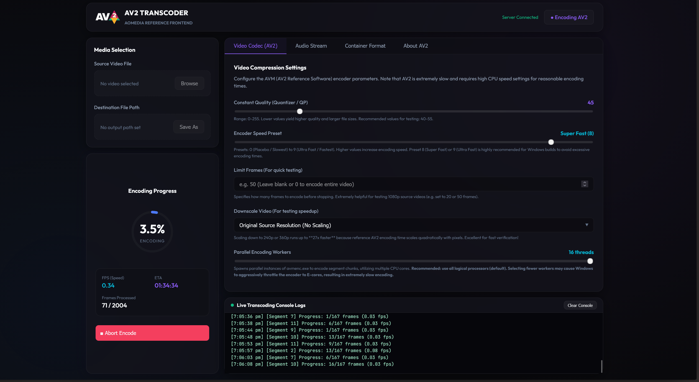
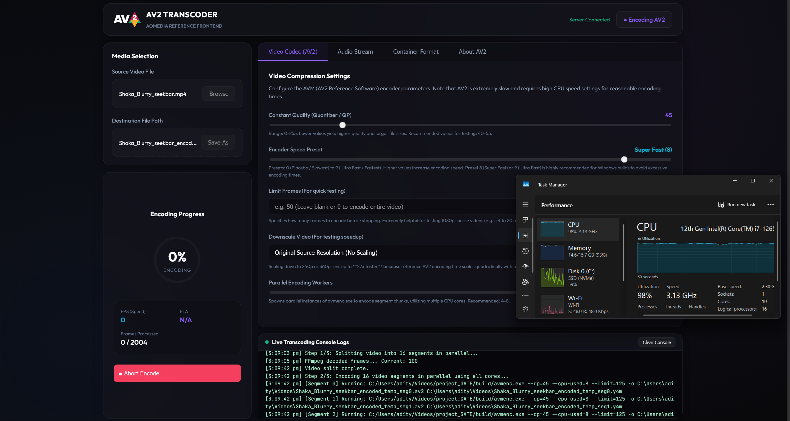

# AV2 GUI Encoder

A web-based GUI for the **AV2 (AVM) reference video codec** with segment-based parallel encoding for full CPU utilization.

## Screenshots




## What It Does

- Splits video into N segments, encodes them in parallel using all CPU cores
- Patches EBML headers to bypass FFmpeg's AV2 codec restrictions
- Merges segments and muxes audio back — losslessly
- **8x–16x faster** than single-threaded `avmenc.exe`

## Quick Start

1. Clone the repo
2. Double-click **`launch.bat`** (the launcher will automatically verify your local `avmenc.exe`, run a fast, non-blocking 1.5-second HEAD check for updates from GitHub releases, and start the servers).

> [!TIP]
> **Zero-Dependency Auto-Setup & Compilation Fallback:** The launcher auto-downloads **Node.js**, **FFmpeg**, and the precompiled **avmenc.exe** if missing. If the precompiled binary download fails (or is not uploaded yet), it automatically starts an automated local builder (`build_encoder.bat`), sets up a clean portable compiler toolchain (WinLibs GCC + CMake + NASM), clones the official AOMedia AV2 (AVM) repository, and builds `avmenc.exe` locally from source using all CPU cores!

## Features

- **Parallel encoding** — adjustable worker count (1 to max cores)
- **Real-time dashboard** — progress, FPS, ETA via WebSocket
- **Resolution downscaling** — 1080p → 240p on-the-fly
- **Frame limiter** — encode only first N frames for testing
- **Audio control** — copy, transcode to Opus, or strip
- **Native file dialogs** — Windows Open/Save pickers with web fallback
- **Non-blocking Auto-Updates** — Checks online release version in <1.5s on start; falls back silently to local binary if offline or no updates are found.

## Project Structure

```
build/avmenc.exe          # AV2 encoder binary (auto-downloaded or user-provided)
build_encoder.bat         # Zero-dependency compiler toolchain & source builder
tools/
  check_encoder.ps1       # Non-blocking version checking and updater script
launch.bat                # One-click launcher (auto-installs deps)
av2_gui/
  backend/
    server.js             # Express + WebSocket server
    encoder.js            # Parallel pipeline + EBML patcher
  frontend/
    src/App.jsx           # React dashboard
    src/index.css         # Dark glassmorphism UI
```

## How The Pipeline Works

```
Input → FFmpeg decode → N segment .y4m files
     → N parallel avmenc.exe instances
     → Patch V_AV2 → V_FFV1 (EBML binary hack)
     → FFmpeg concat + audio mux
     → Patch V_FFV1 → V_AV2 (restore)
     → Final .mkv/.webm output
```

## Requirements

- **Windows 10+**
- **Git** (only required if cloning/compiling from source using the local builder fallback)
- Everything else (Node.js, FFmpeg, compiler toolchain, and `avmenc.exe` binary) is automatically handled by the launcher.

## Manual Start (Optional)

```bash
cd av2_gui/backend && npm install && npm start
cd av2_gui/frontend && npm install && npm run dev
```

Open `http://localhost:5173`
